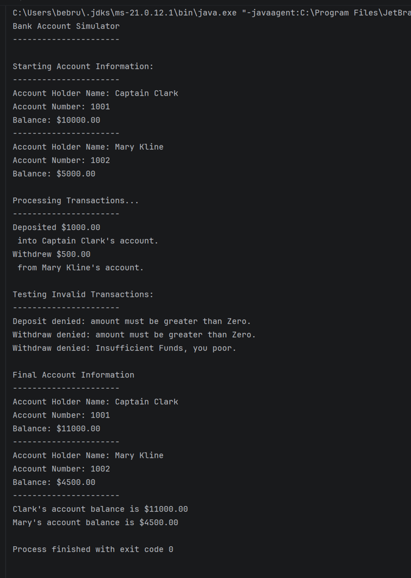

# Bank Account Simulator

A simple Java program that simulates basic bank account transactions. The program uses a BankAccount class to create accounts, deposit money, withdraw money, check balances, and prevent invalid transactions.

## Features

- Creates multiple bank accounts
- Deposits money
- Withdraws money
- Prevents negative deposits and withdrawals
- Prevents withdrawals that exceed the account balance
- Displays account information and balances

## How to Run

1. Open the project in IntelliJ IDEA.
2. Open `Main.java`.
3. Run the `Main` class.
4. View the program output in the console.

## Screenshot

